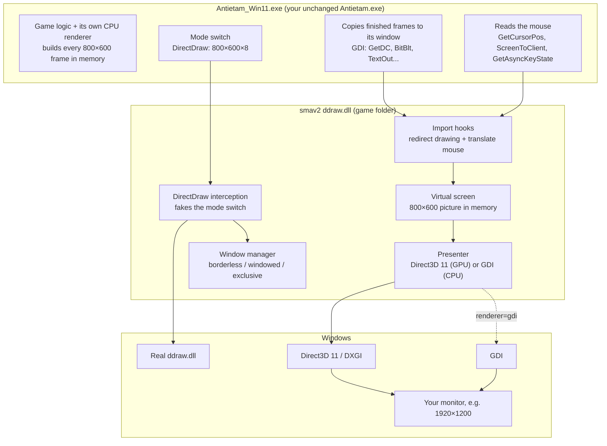
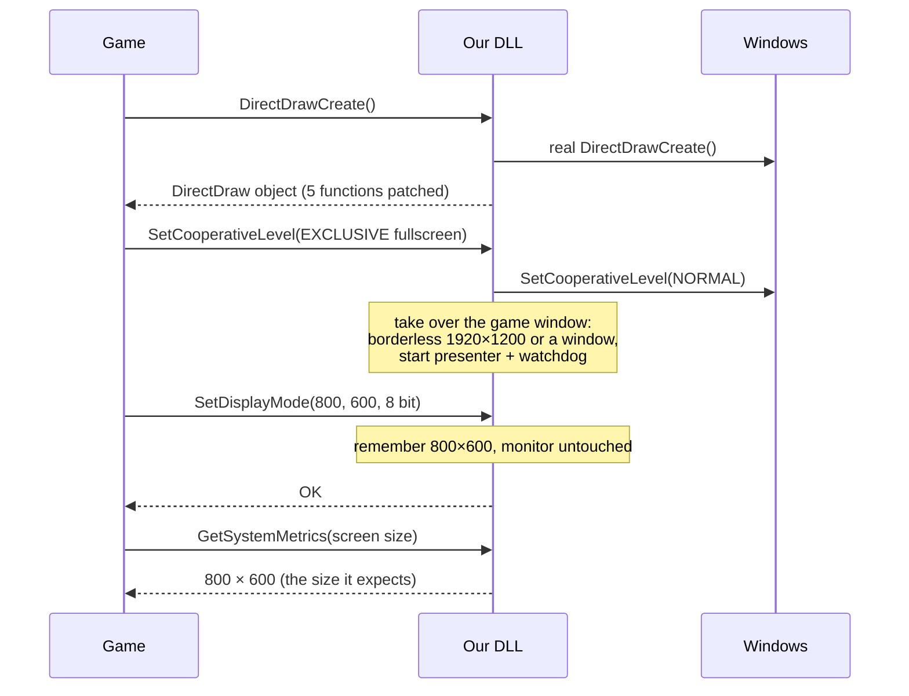
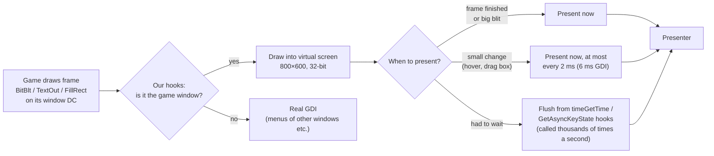
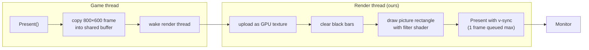
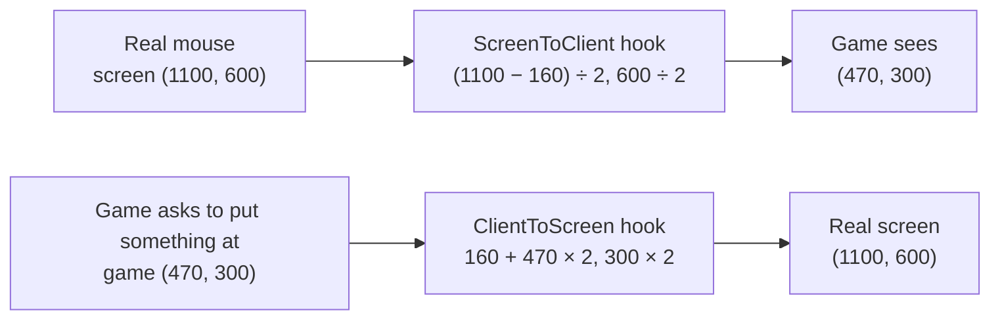

*Sid Meier's Antietam! · Windows 10/11*

# How our ddraw.dll works

The game was built in 2000 for a 800×600, 256-colour fullscreen screen. Our DLL sits between the game and Windows, keeps the game believing it has that screen, and shows its picture the modern way: enlarged, sharp, in a window or borderless, through the graphics card.

## 1. Where the DLL sits

The game asks Windows for `ddraw.dll` by name. Windows looks in the game folder first, so it gets ours. We load the real Windows DirectDraw ourselves and pass most things on. Only the parts that matter are changed.

## 2. Start-up: faking the 800×600 switch

The game only uses DirectDraw for the screen-mode switch. We let it create the real DirectDraw object, then swap five of its functions for ours. From then on the game thinks the monitor is at 800×600; in reality nothing changes, and we take over its window.

> With `mode=fullscreen` none of this happens: the DLL passes every call straight to Windows and the game runs exactly like the original.

## 3. One frame: from the game to your screen

The game draws into what it thinks is its window. Our hooks redirect every drawing call into the **virtual screen**, an invisible 800×600 picture. When the game finishes a frame, or draws even a small change such as a hover highlight, we present: enlarge the picture and put it on the real screen.

## 4. The presenter: two threads, no waiting

With `renderer=d3d11` the game thread only copies the finished picture (about 0.2 ms) and signals a separate render thread. That thread owns the graphics card connection, uploads the picture as a texture, runs the chosen filter shader and waits for v-sync. The game never waits for the GPU, so its own timing stays exactly as Firaxis made it.

| Filter | What it does | Best for |
|---|---|---|
| `nearest` | Each game pixel becomes a solid block | Whole factors: 2× (your 1600×1200) |
| `sharp` | Solid blocks, blended only along their edges | Odd sizes: 1024×768, 1280×960 |
| `linear` | Smooth blend everywhere | Softer look |
| `scale2x` | Rounds off jagged diagonal pixel edges | Trying a smoothed pixel-art look |
| `auto` | nearest at whole factors, sharp otherwise | Default |

> If Direct3D 11 cannot start, or the graphics driver resets twice, the DLL switches to the GDI presenter by itself: the CPU does the enlarging with Windows' old drawing functions.

## 5. The mouse: translating coordinates

The game expects a 800×600 screen with the mouse between 0 and 799. On your monitor the picture is 1600×1200 starting 160 pixels from the left. Our hooks translate every position the game reads, and the cursor is kept inside the picture so edge scrolling works.

- **Mouse messages** (clicks, moves) are translated the same way before the game's window code sees them.
- **Clip**: while the game is active the cursor cannot leave the picture, so touching the edge scrolls the map.
- **Any size**: the maths is exact for any window size, which is why resizing and maximising work.

## 6. Keeping an old game happy in a modern window

| Problem | Cause | What the DLL does |
|---|---|---|
| Fake "Not Responding" freeze | The game never reads its mouse/keyboard messages, so Windows covered it with a frozen ghost image | Turns ghosting off for the game |
| Game pausing on focus loss | Written for exclusive fullscreen | Never tells the game it lost focus (`keep_focus`) |
| Game moving its window to (0,0) | It still thinks it is fullscreen | Ignores the game's own window moves; you can still move/resize it |
| Mouse lag on hover and drag | Small updates waited for a timer the game only processes every ~160 ms | Presents small changes immediately (79 ms → 2 ms) |

## 7. The four modes

| `mode=` | Monitor | Picture | Drawn by |
|---|---|---|---|
| `borderless` (default) | Stays 1920×1200 | Whole-factor enlarged, centred (2× = 1600×1200) | Direct3D 11 or GDI |
| `windowed` | Stays 1920×1200 | Any 4:3 size, resizable, e.g. 1024×768 | Direct3D 11 or GDI |
| `exclusive` | Switches to 800×600 (full colour) | 1:1 | Direct3D 11 exclusive fullscreen |
| `fullscreen` | Switches to 800×600×256 colours | Original | The game itself (DLL passes through) |

## 8. Files

| File (`ddraw/`) | Role |
|---|---|
| `smav2_ddraw.cpp` | DirectDraw interception, window manager, import hooks, virtual screen, GDI presenter, watchdog |
| `present_d3d11.cpp / .h` | Direct3D 11 presenter and its render thread, exclusive fullscreen |
| `shaders.hlsl` | The filter shaders (compiled into the DLL at build time) |
| `ddraw.def` | The DLL's export list, identical to Windows' ddraw.dll |
| `smav2.ini` | Your settings: mode, scale, window size, filter, renderer, v-sync |
| `build.bat` | Builds everything with Visual Studio |

> The Windows 11 crash fixes are in the DLL too: it redirects the game's wrong memory-free calls (GlobalFree) to the game's own correct routine, and the installer runs the game under a new name (`Antietam_Win11.exe`) so Windows' broken compatibility fix for `Antietam.exe` doesn't apply. Your `Antietam.exe` is never modified.

---
An HTML version with the same diagrams is in `architecture.html`; open it in a browser. The technical details are in `ddraw-dll.md`.
